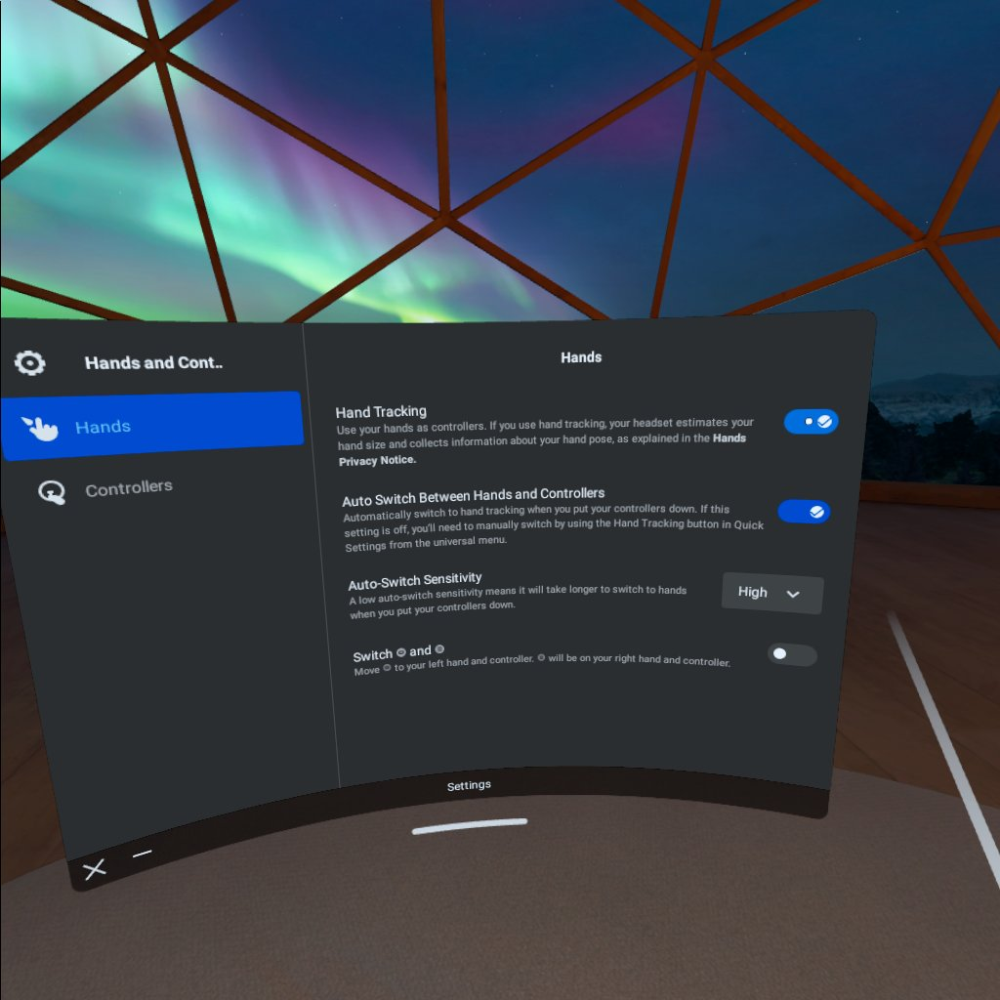
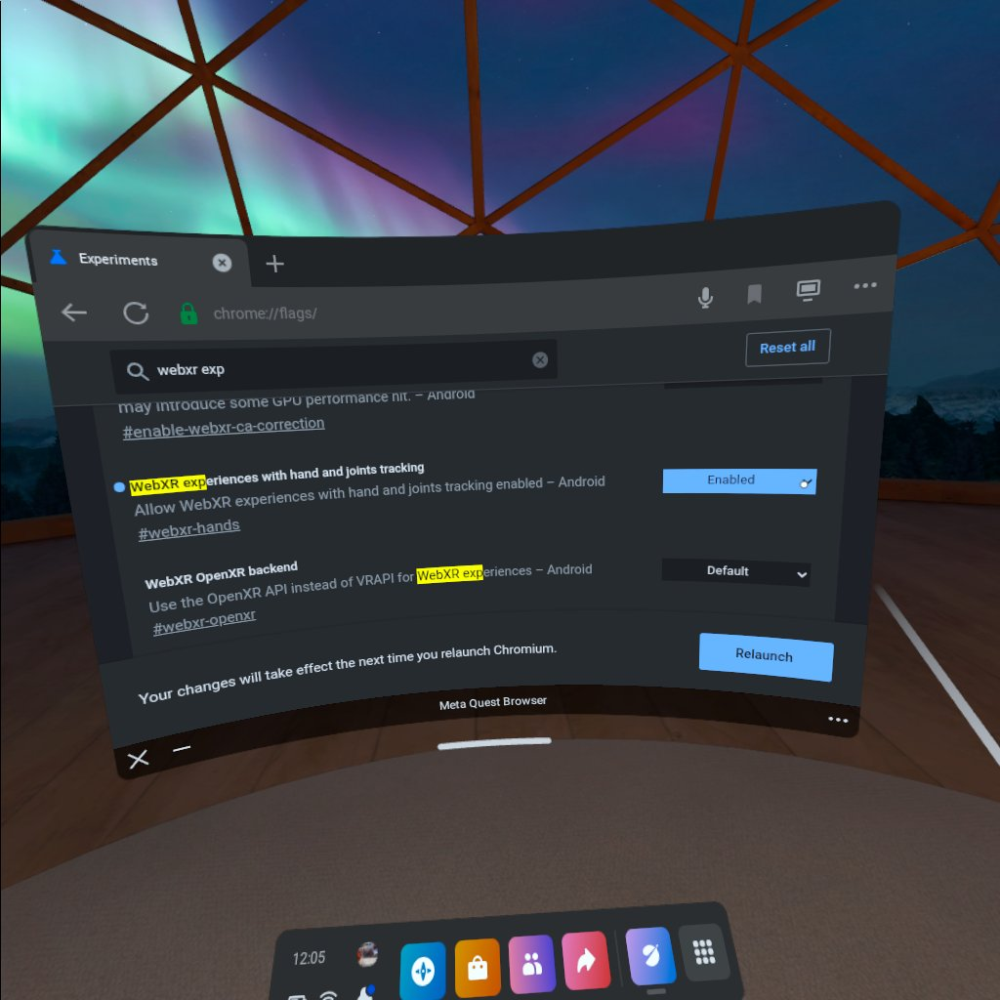

# hands-track

# Task -- Prepare headset
1. Enable hands tracking in `Hands and Controllers` settings
2. Open `chrome://flags/` page and enable experimental feature `WebXR experiences with hand and joints tracking` for browser

# Add hand tracking
```JavaScript
      const handModelFactory = new XRHandModelFactory().setPath(assetsPath)

      this.hand1 = this.renderer.xr.getHand( 0 );
      this.scene.add( this.hand1 );

```